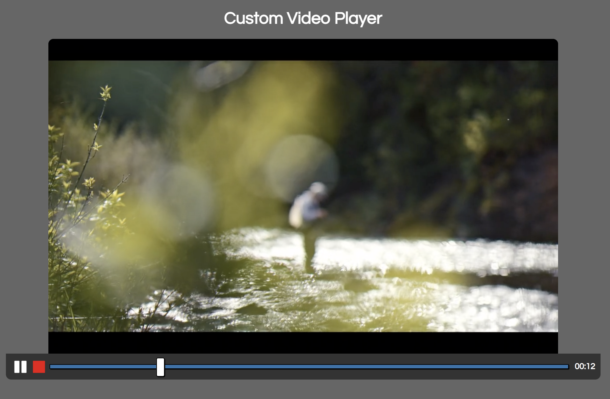
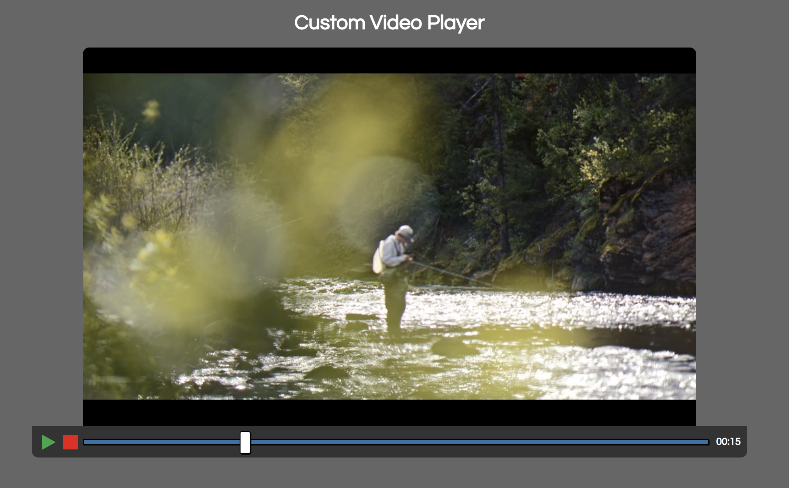

# custom-video-player

## Description 

This is a completely video player that was used the Javascript API. The project uses a timestap that users can play or pause the video anytime.  

## Sample Image 

